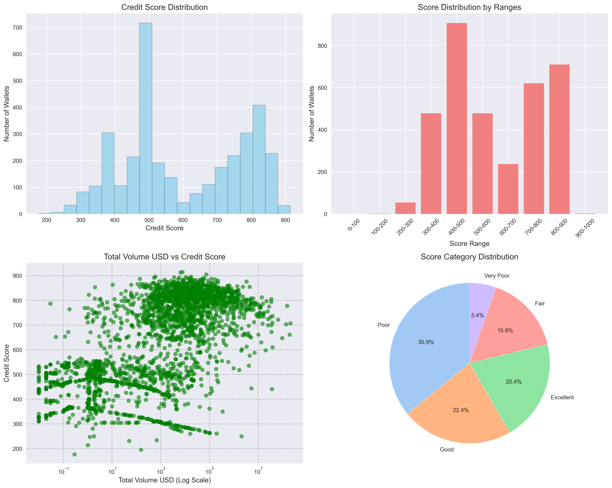

# DeFi Credit Score Analysis Report

## Executive Summary

This report analyzes the credit scores of 3497 unique wallet addresses based on their DeFi transaction behavior, lending/borrowing patterns, and risk indicators.

## Key Findings

- **Average Credit Score:** 599.4
- **Median Credit Score:** 543.0
- **Score Range:** 177 - 915

## Score Distribution Analysis

### Distribution by Score Ranges

| Score Range | Count | Percentage |
|-------------|-------|------------|
| 0-100 | 0 | 0.0% |
| 100-200 | 2 | 0.1% |
| 200-300 | 55 | 1.6% |
| 300-400 | 479 | 13.7% |
| 400-500 | 908 | 26.0% |
| 500-600 | 479 | 13.7% |
| 600-700 | 238 | 6.8% |
| 700-800 | 622 | 17.8% |
| 800-900 | 711 | 20.3% |
| 900-1000 | 3 | 0.1% |

### Distribution by Risk Categories

| Category      | Count | Percentage |
|---------------|-------|------------|
| Excellent     |   714 |       20.4% |
| Good          |   785 |       22.4% |
| Fair          |   554 |       15.8% |
| Poor          |  1256 |       35.9% |
| Very Poor     |   188 |        5.4% |

## Behavioral Analysis by Score Range

### Very Low (0-200)

**Wallet Count:** 2

**Key Characteristics:**
- Average Trading Volume: $78.21
- Average Transactions: 2.0
- Average Days Active: 1.0
- Liquidation Ratio: 0.0000
- Deposit Activity: 0.50
- Borrow Activity: 0.00
- Asset Diversity: 1.0
- Burst Activity Ratio: 0.5000
- Lenders: 50.0%
- Borrowers: 0.0%

### Low (200-400)

**Wallet Count:** 534

**Key Characteristics:**
- Average Trading Volume: $6,893.08
- Average Transactions: 1.4
- Average Days Active: 1.2
- Liquidation Ratio: 0.0000
- Deposit Activity: 0.84
- Borrow Activity: 0.03
- Asset Diversity: 1.0
- Burst Activity Ratio: 0.1008
- Lenders: 87.3%
- Borrowers: 5.6%

### Medium (400-600)

**Wallet Count:** 1387

**Key Characteristics:**
- Average Trading Volume: $62,633.54
- Average Transactions: 14.5
- Average Days Active: 1.6
- Liquidation Ratio: 0.0000
- Deposit Activity: 0.82
- Borrow Activity: 0.08
- Asset Diversity: 1.3
- Burst Activity Ratio: 0.2914
- Lenders: 95.8%
- Borrowers: 18.0%

### High (600-800)

**Wallet Count:** 860

**Key Characteristics:**
- Average Trading Volume: $2,006,252.01
- Average Transactions: 48.4
- Average Days Active: 9.6
- Liquidation Ratio: 0.0000
- Deposit Activity: 0.44
- Borrow Activity: 0.19
- Asset Diversity: 3.2
- Burst Activity Ratio: 0.6338
- Lenders: 95.1%
- Borrowers: 73.5%

### Very High (800-1000)

**Wallet Count:** 714

**Key Characteristics:**
- Average Trading Volume: $239,809.87
- Average Transactions: 52.1
- Average Days Active: 16.4
- Liquidation Ratio: 0.0000
- Deposit Activity: 0.42
- Borrow Activity: 0.22
- Asset Diversity: 4.7
- Burst Activity Ratio: 0.5077
- Lenders: 100.0%
- Borrowers: 100.0%

## Detailed Statistical Report

```
Total Wallets Analyzed: 3497

SCORE DISTRIBUTION:
 Excellent   :  714 ( 20.4%)
 Good        :  785 ( 22.4%)
 Fair        :  554 ( 15.8%)
 Poor        : 1256 ( 35.9%)
 Very Poor   :  188 (  5.4%)

SCORE STATISTICS:
 Mean Score      : 599.4
 Median Score    : 543.0
 Std Deviation   : 176.0
 Min Score       : 177
 Max Score       : 915

High Performers (650+): 1499 wallets
 - Average volume: $1,161,811.69
 - Lenders         : 98.3%
 - Borrowers       : 88.1%
 - Average Tx Frequency: 3.83
 - Average Asset Entropy: 1.52
Low Performers (<350): 188 wallets
 - Average volume: $16,672.61
 - Average liquidation ratio: 0.0000
 - Average Tx Frequency: 1.14
 - Average Asset Entropy: 0.02

TOP FEATURE IMPORTANCE (from PCA):
  1. is_borrower              : 0.3475
  2. action_diversity         : 0.3178
  3. burst_activity_ratio     : 0.2091
  4. unique_assets            : 0.2089
  5. time_regularity          : 0.2076
  6. tx_frequency             : 0.2065
  7. rapid_transaction_ratio  : 0.2032
  8. asset_entropy            : 0.2019
  9. primary_asset_dominance  : 0.1993
 10. borrow_ratio             : 0.1976

PCA ANALYSIS:
 Components retained     : 11
 Explained variance ratio: 0.957
```

## High-Risk Patterns Identified

**188 wallets** identified as high-risk (score < 350):

**Common Risk Factors (Averages for this group):**
- Average Liquidation Ratio: 0.0000
- Average Time Regularity: 0.1205 (Higher values indicate less regularity)
- Average Burst Activity Ratio: 0.0943
- Average Top 10% Volume Ratio: 0.9500 (Potentially indicating concentrated, less diversified large transactions)
- Average Round Amount Ratio: 0.0000


---
